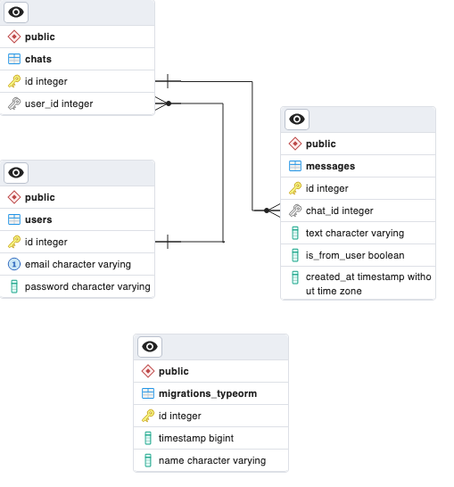
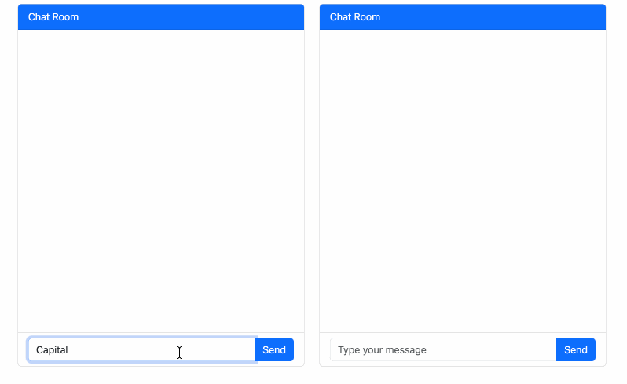

## Description

Chat application that features two separate chat views within the same interface with simple user authentication. The application uses React with TypeScript for the front end, NestJS for the back end and websockets for publishing messages. It integrates OpenAI's GPT model to simulate one side of the conversation.

## Setup

* Clone this repo.

* Install Node.js preferably version 21.5.0 to avoid mismatches:
https://nodejs.org/en/download/current


* Run ```npm install ```

* Run ```cp .env.example .env ```

* Edit the `.env` file and place your credentials.

* Install PostgreSQL: https://www.postgresql.org/download/

* Create database in PostgreSQL and user according to the specified credentials in `.env`

* Run `sudo npm install --global cross-env`

## Running the app in development

* Start NestJS server & watch code changes:
`npm run start:dev`

* Watch frontend assets:
`npm run front-end-watch`


## Test

* Unit tests: `npm run test`

* e2e tests: `npm run test:e2e`

* test coverage: `npm run test:cov`


## ERD - Entity Relationship Diagram

Indicates the attributes and relationship of the database tables:


## Chat Preview


## License

Has [MIT license](LICENSE).
